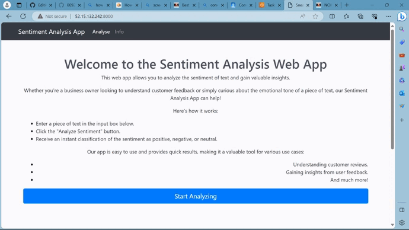

# Sentiment Analysis API

## Overview
This project is a Django web application that provides an API for sentiment analysis. The sentiment analysis model is built using logistic regression. The application is containerized using Docker and deployed on AWS using ECS, ECR, and Fargate. It also includes a CI/CD workflow using GitHub Actions that automatically builds and deploys the application when changes are pushed to the repository.

## Features
- **Sentiment Analysis**: Analyze the sentiment of a given text.
- **Dockerized Application**: The application is dockerized for easy deployment and scaling.
- **AWS Deployment**: The application is deployed on AWS using ECS, ECR, and Fargate for robustness and scalability.
- **CI/CD Workflow**: The project includes a CI/CD workflow using GitHub Actions that automatically builds and deploys the application when changes are pushed to the repository.

## Getting Started

### Prerequisites
- Docker
- AWS CLI

### Installation
1. Clone the repository

`git clone <repository_url>`

2. Build the Docker image

`docker build -t sentiment-analysis-api . `

3. Push the Docker image to ECR

`aws ecr get-login-password --region region | docker login --username AWS --password-stdin <ecr_repository_url>` 

`docker tag sentiment-analysis-api:latest <ecr_repository_url>:latest`

`docker push <ecr_repository_url>:latest`

4. Deploy the Docker image on ECS with Fargate

Update the task definition with the new Docker image

`aws ecs register-task-definition --cli-input-json file://task-definition.json`

Update the service with the new task definition

`aws ecs update-service --service sentiment-analysis-api --task-definition sentiment-analysis-api --cluster cluster-name`

**NB:** to access the app you have to open the task in the AWS ECS console to access the web adress, make sure to add :8000 to the public link as the app is exposed in port 8000, the link will change everytime the app is deployed, thus after every succesful deployment use the new provided link. dont forget to add :8000 to the link. example http://52.15.132.242/ is what you will get from the AWS ECS console, and this is what you will run to access the app http://52.15.132.242:8000/ 

## Usage of the API

#### CI/CD Workflow
The project includes a CI/CD workflow using GitHub Actions. This workflow is triggered whenever changes are pushed to the repository. It automatically builds a new Docker image, pushes it to ECR, and deploys it on ECS with Fargate.

**License**
This project is licensed under the MIT License.

**Contact**

[Katlego KGOSI - Email me](201802440@spu.ac.za)

[Project Link](https://github.com/0092kat/sentiment_analysis_api) 
